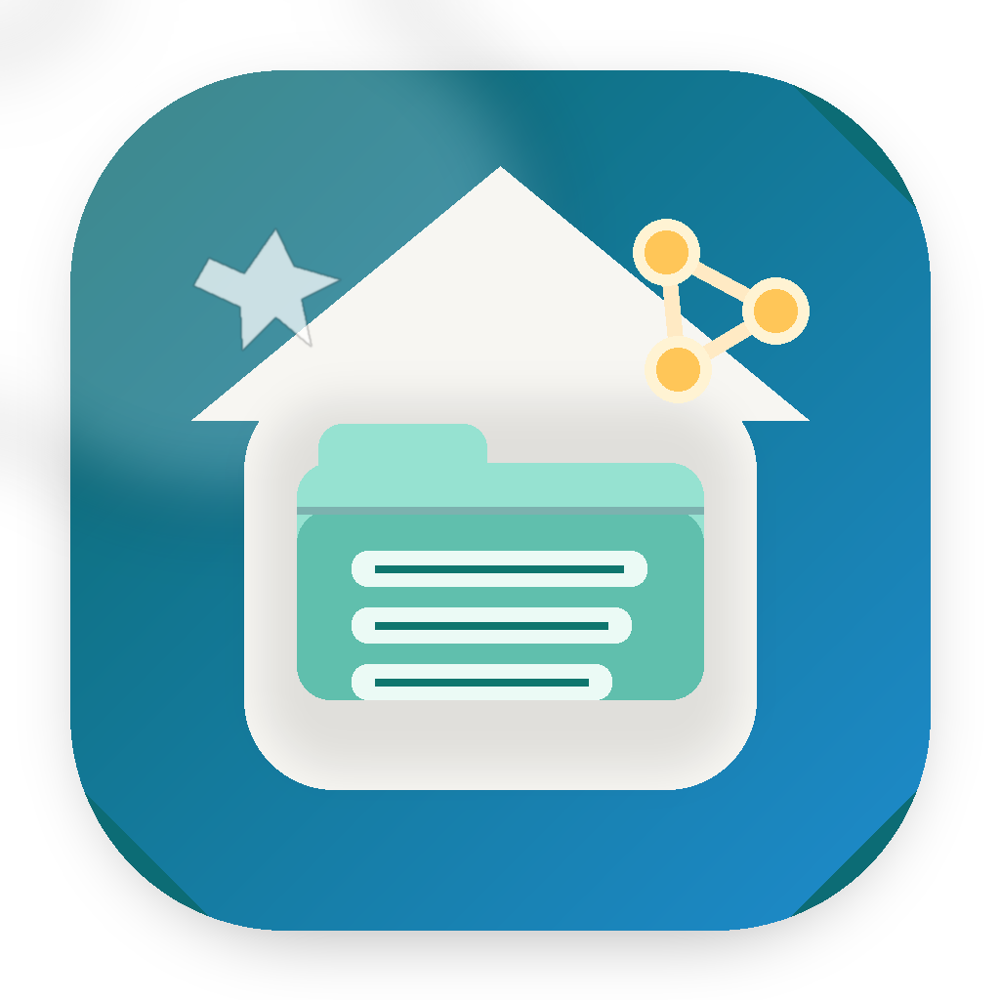
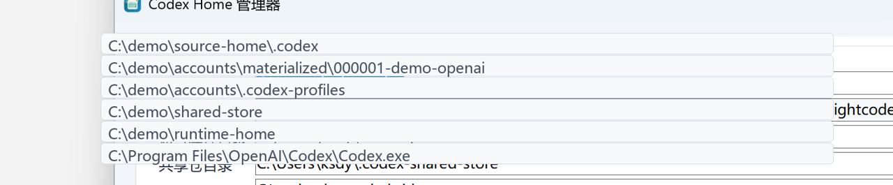
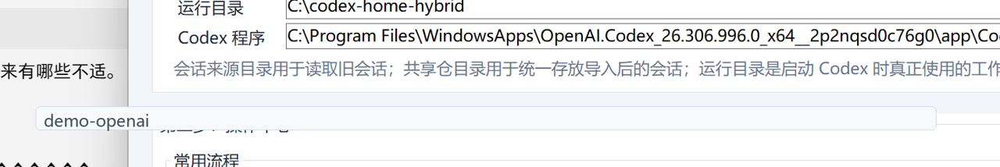
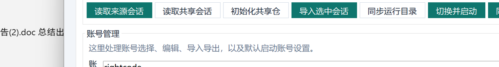

# Codex Home Manager



`Codex Home Manager` 是一个面向 Windows 的 WinForms 工具，用来管理 `Codex` 的账号资料、共享会话仓、运行目录，以及 `Codex.exe` 的启动与切换流程。

它解决的核心问题是：

- 一个账号的 `auth.json` / `config.toml` 不想手工来回拷贝
- 多个账号想统一保存在一个数据库里，而不是散落在很多目录
- 想把旧 `CODEX_HOME` 里的会话导入到新的共享仓
- 想把“账号配置”和“会话状态”拆开管理，再按需同步到真正运行的 `CODEX_HOME`
- 想在切换账号、切换共享仓、启动 Codex 时少走重复步骤

## 主要功能

- 读取来源 `CODEX_HOME` 中的会话列表
- 将选中的单条会话导入到共享仓
- 将共享仓 + 当前账号配置同步到运行目录
- 自动定位 `Codex.exe` 并使用指定 `CODEX_HOME` 启动
- 将账号内容存入 SQLite，而不是长期依赖实体 `auth.json` / `config.toml`
- 在需要时把数据库中的账号内容物化到临时目录
- 支持新建空账号、重命名账号、删除账号、导入账号、导出账号
- 为不同共享仓设置各自默认启动账号
- 监控 `auth.json` / `config.toml` 变化，并在需要时自动同步回数据库与运行目录

## 界面预览

下面的截图使用的是示例路径和示例账号名，便于说明界面结构。

### 1. 目录设置



### 2. 常用流程与账号管理



### 3. 会话列表与详情区域



## 适用场景

这个工具比较适合下面几类用法：

- 一台机器上维护多个 Codex 账号
- 想把不同来源的会话统一导入到一个共享仓
- 想把账号配置保存在数据库中，避免手工拷文件
- 想快速完成“切换账号 -> 同步运行目录 -> 启动 Codex”
- 想长期维护一个稳定的 `runtime CODEX_HOME`

## 核心概念

界面第一步里的几个目录含义如下：

| 项目 | 说明 |
| --- | --- |
| 会话来源目录 | 旧会话的读取来源。通常是历史 `CODEX_HOME`。程序会扫描 `sessions`、`session_index.jsonl`、`history.jsonl`、`state_5.sqlite`。 |
| 当前账号目录 | 当前选中账号的临时落地目录。内容来自 SQLite 中的账号记录，不建议手工长期维护。 |
| 账号库存目录 | 兼容旧目录式账号仓的入口。首次运行时可用于迁移老账号。 |
| 共享仓目录 | 导入后的会话集中存放的位置。你可以把它理解为“统一会话仓库”。 |
| 运行目录 | 真正启动 Codex 时使用的 `CODEX_HOME`。共享仓内容与当前账号配置会同步到这里。 |
| Codex 程序 | `Codex.exe` 的实际路径。留空时程序会尝试自动寻找。 |

## 推荐工作流

### 场景一：第一次配置

1. 设置 `会话来源目录`
2. 设置 `共享仓目录`
3. 设置 `运行目录`
4. 选择或导入一个账号
5. 点击 `初始化共享仓`
6. 点击 `同步运行目录`
7. 点击 `同步并启动` 或 `切换并启动`

### 场景二：把旧会话导入当前环境

1. 选择要使用的账号
2. 点击 `读取来源会话`
3. 在下方会话列表中选中一条会话
4. 点击 `导入选中会话`
5. 全部导入完成后，再点击 `同步运行目录`
6. 最后点击 `切换并启动`

### 场景三：管理账号

1. 在 `账号管理` 区域选择一个账号
2. 需要从当前目录回写数据库时，点击 `保存当前账号`
3. 需要新账号时，点击 `新建空账号`
4. 需要导入外部账号目录时，点击 `导入账号`
5. 需要导出给别的目录使用时，点击 `导出账号`
6. 需要给当前共享仓设置默认账号时，使用 `默认账号映射`

## 账号与数据库设计

这个项目已经把账号管理改造成“数据库优先”的模式。

### 设计原则

- `auth.json` 和 `config.toml` 的主存储位置是 SQLite
- 账号切换时，才把数据库中的内容物化到临时目录
- 运行 Codex 时，再把需要的配置写入运行目录
- 因此账号本身不依赖某一个固定物理目录长期存在

### 默认存储位置

程序默认会使用下面这些位置：

- 账号数据库：`%LOCALAPPDATA%\\CodexHomeManager\\managed-accounts.db`
- 临时账号目录：`%LOCALAPPDATA%\\CodexHomeManager\\materialized-profiles`
- 界面设置：`%LOCALAPPDATA%\\CodexHomeManager\\ui-settings.json`

### SQLite 中的关键表

| 表名 | 用途 |
| --- | --- |
| `accounts` | 账号基础信息，如名称、提供方、启用状态 |
| `account_contents` | 真正保存 `auth.json` 与 `config.toml` 文本内容 |
| `shared_store_defaults` | 共享仓与默认启动账号之间的映射关系 |
| `materialized_targets` | 记录运行目录或目标目录最近一次被写入的状态 |
| `app_settings` | 一些程序级设置 |

## 会话导入与同步逻辑

程序在导入和同步时，主要会处理这些内容：

- `sessions/`
- `session_index.jsonl`
- `history.jsonl`
- `state_5.sqlite`
- `.codex-global-state.json`
- `auth.json`
- `config.toml`

### 导入选中会话时会做什么

- 从来源目录复制目标会话的 `jsonl` 文件
- 更新共享仓里的 `session_index.jsonl`
- 更新共享仓里的 `state_5.sqlite`
- 追加对应的 `history.jsonl` 记录
- 可选刷新 `updated_at`
- 可选把会话的工作区路径写入 `.codex-global-state.json`

### 同步运行目录时会做什么

- 将共享仓中的会话状态同步到运行目录
- 将当前账号的 `auth.json` / `config.toml` 写入运行目录
- 根据设置决定是否覆盖运行目录现有配置
- 让最终启动的 Codex 使用统一、可控的 `CODEX_HOME`

## 自动同步配置变更

勾选 `自动同步配置变更` 后，程序会监控当前账号目录和运行目录中的配置变化。

适用场景：

- 你在外部修改了 `auth.json`
- 你在外部修改了 `config.toml`
- 你希望这些变化能自动回写到数据库，并继续保持运行目录一致

这项功能是“尽力同步”，但如果 Codex 正在运行，程序会优先避免和运行中的实例发生冲突。

## 项目结构

| 路径 | 说明 |
| --- | --- |
| `Program.cs` | 程序入口 |
| `Form1.cs` | 主界面逻辑、布局与事件处理 |
| `Form1.Designer.cs` | WinForms 设计器代码 |
| `Services/CodexManager.cs` | 会话读取、会话导入、启动 Codex、状态修复等核心逻辑 |
| `Services/ProfileStore.cs` | SQLite 账号管理、物化目录、默认映射 |
| `Services/AppSettingsStore.cs` | UI 设置持久化 |
| `Assets/` | 图标、截图等资源 |

## 运行方式

### 方式一：直接运行源码

要求：

- Windows
- .NET 9 SDK

命令：

```powershell
dotnet run --project C:\codex\CodexHomeManager
```

### 方式二：构建后运行

```powershell
dotnet build C:\codex\CodexHomeManager -c Release
```

构建产物通常位于：

```text
C:\codex\CodexHomeManager\bin\Release\net9.0-windows\
```

### 方式三：发布为独立 exe

```powershell
dotnet publish C:\codex\CodexHomeManager\CodexHomeManager.csproj `
  -c Release `
  -r win-x64 `
  --self-contained true `
  -p:PublishSingleFile=true
```

## 常见注意事项

- 切换运行目录或启动新账号前，尽量先关闭正在运行的 Codex
- 如果 `Codex.exe` 路径为空，程序会尝试自动搜索安装位置
- `当前账号目录` 是临时物化目录，不建议把它当作唯一账号备份
- 如果你连续导入多条会话，建议在全部导入完成后再做一次 `同步运行目录`
- `共享仓默认映射` 适合在同一台机器上维护多个共享仓时使用

## 已知限制

- 当前是 WinForms 桌面程序，主要面向 Windows 使用
- 截图、图标和布局已针对当前版本优化，但不同缩放比例下仍可能需要继续微调
- 程序假设你使用的是本地安装版 `Codex.exe`

## 开发说明

如果你准备继续扩展这个项目，建议优先阅读：

- `Form1.cs`
- `Services/CodexManager.cs`
- `Services/ProfileStore.cs`

这三处基本覆盖了界面、会话同步、账号存储三个核心面。
